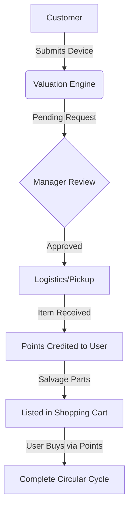

# Electronic Waste (E-Waste) Management & Recycling System

A Full-Stack Circular Economy solution that digitizes e-waste recycling—from automated device valuation to component recovery and points-based reselling.
##  Why This Project? (The Problem)
Electronic waste often ends up in landfills, causing environmental hazards. This system solves this by incentivizing users to recycle through a Loyalty Rewards Program, turning old devices into valuable salvaged components for a sustainable e-commerce marketplace.

##  Core Features

### 1. Role-Based Access Control (RBAC) 
The system implements a secure multi-user environment where each role (Admin vs. Customer) has a tailored interface and specific permissions.

* **Security & Auth:** Robust protection using **JWT** and **BCrypt** hashing.
* **Role-Specific Portals:** Tailored Dashboards for Admins (Analytics via **Chart.js**) and Customers (Points Wallet & Order Tracking).
  
### 2. Dynamic Valuation & Pricing Engine
* **Automated Estimation:** A smart engine that calculates the device's value instantly based on category and technical condition (20%, 50%, 80%, 100%).
* **Logistics Workflow:** Integrated system for choosing disposal methods (Branch Drop-off vs. Scheduled "Mandoob" Pickup) with dynamic address mapping.
  
### 3. Managerial Approval & Review Workflow
* **Request Lifecycle:**Admins receive recycling offers and can **Approve or Reject** them based on device specifications and recovery potential.
* **Real-Time Status Tracking:** Users receive live updates in their profile as the request moves from **Pending to Received** and finally **Processed**.

### 4. Inventory & Component Salvaging (Master-Detail)
* **Master-Detail Architecture:**Administrators can decompose a single recycled device **(Master)** into multiple functional spare parts **(Details)** like Screens, Batteries, and RAM.
* **Live Stock Management:** Instant inventory updates in the e-commerce shop once salvaged components are verified as functional.

### 5. Loyalty Points & E-Commerce Integration
* **Points Engine:** A specialized engine that credits the user's digital wallet with **Loyalty Points** immediately upon a successful recycling transaction.
* **Redemption Store:** A full shopping cart where users can buy refurbished devices or salvaged parts using their earned points or cash.
* **Wallet Management:** Real-time points balance and transaction history in the User Dashboard.

### 6. Business Analytics & Reporting
* **Performance Charts:** Visualizing daily recycling requests, sales volume, and user growth using **Chart.js**.
* **Order History:** Comprehensive logs for managers to track every sale and recycling deal.

##  Tech Stack
* **Frontend:** React.js, Redux Toolkit (Complex State Management), **Axios** For Fetching Data ,**Bootstrap**,Custom CSS.
* **Backend:** .NET Core Web API (RESTful Services), JWT Authentication, Entity Framework Core.
* **Database:** MS SQL Server using EF Core Code-First Approach (Migrations, Data Modeling)
* **Data Visualization:** Chart.js for business analytics.
* **Principles:** Developed with **Clean Code** standards, **SOLID Principles**, and **Focusing on Modular Logic**.

##  Database Architecture & Logic
The system relies on a robust relational schema:
* **One-to-Many:** Users ➡️ Recycling Requests.
* **One-to-Many:** Recycled Device ➡️ Salvaged Components.
* **Automation:** The system automatically calculates loyalty points based on device condition and updates the user's wallet balance upon manager approval. 

##  System Workflow (Business Logic)

## 🔧 Installation & Setup
1. Clone the repo: `git clone https://github.com/Toqa-Ashraf8/Electronic_Waste_Recycling_System.git`
2. **Backend:** - Update `appsettings.json` with your SQL connection string.ٍ
   - Run `dotnet ef database update`.
   - Run `dotnet run`.
3. **Frontend:** - Run `npm install`.
   - Run `npm start`.
