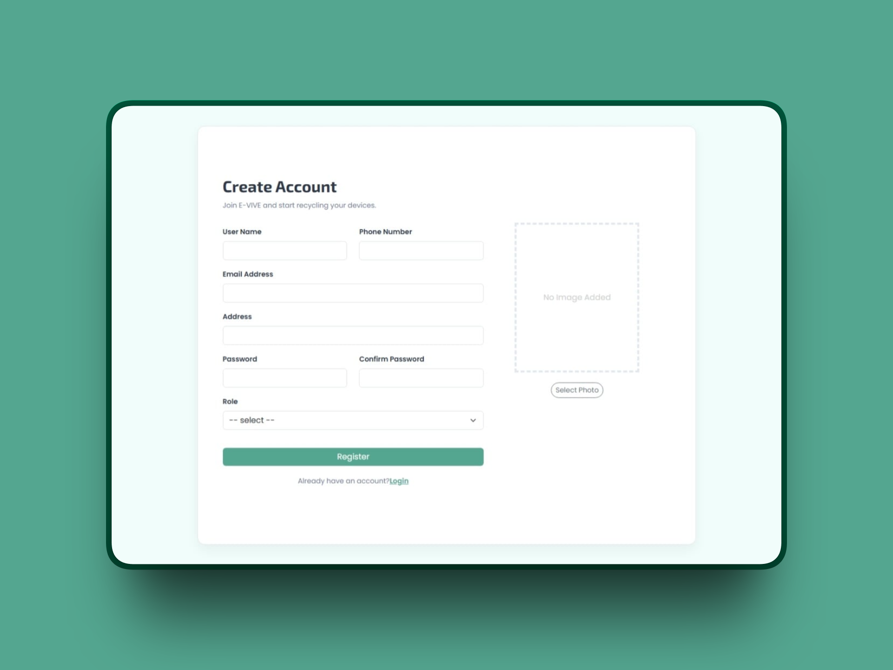
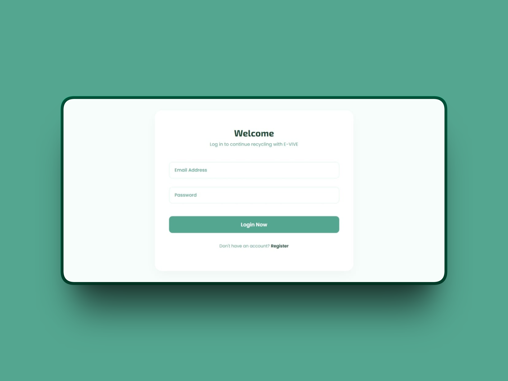
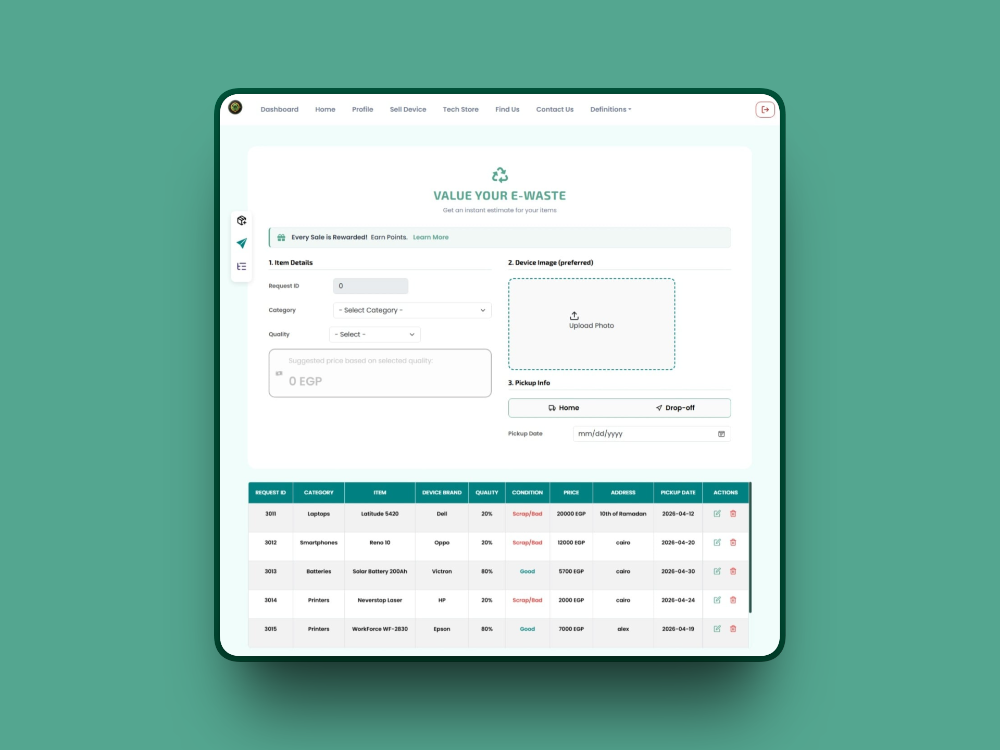
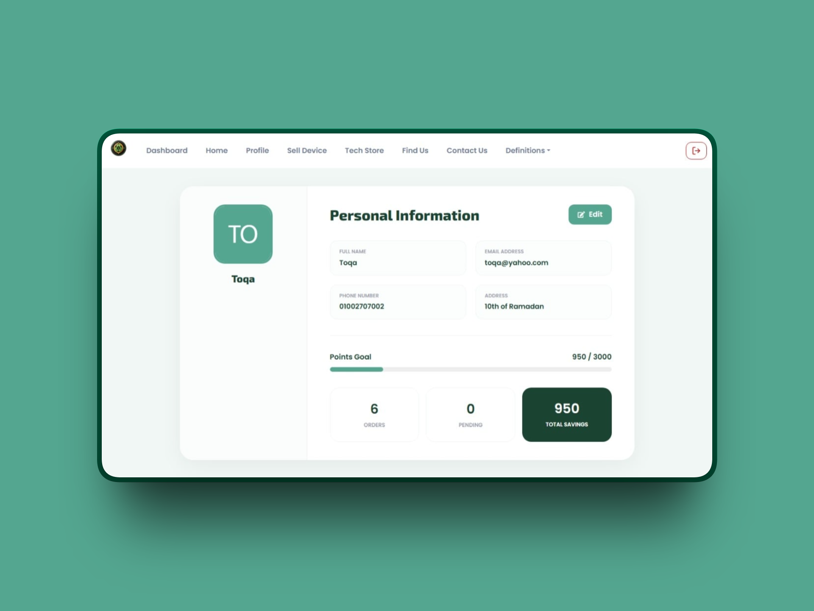
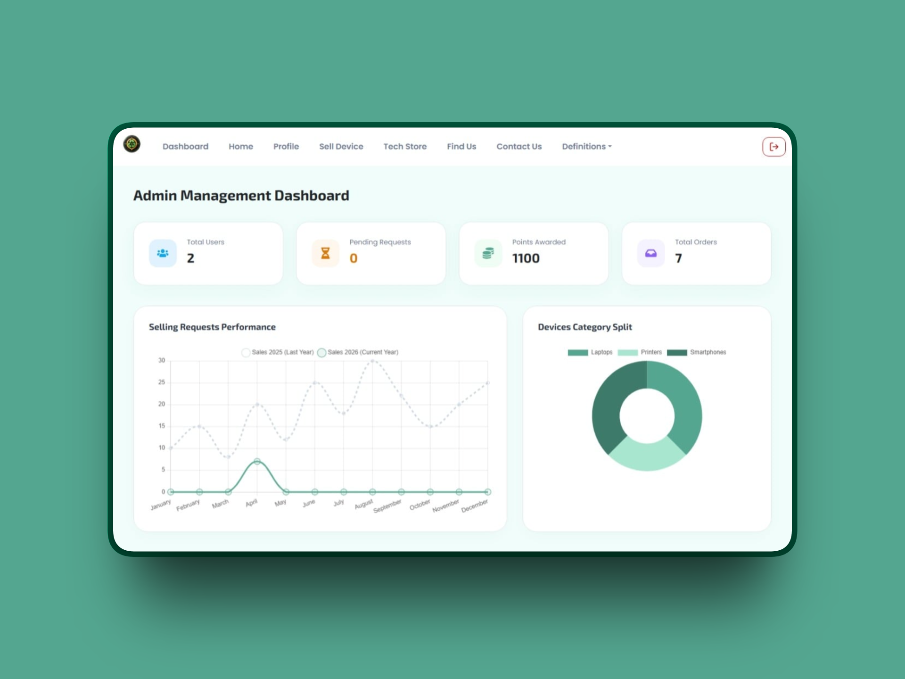
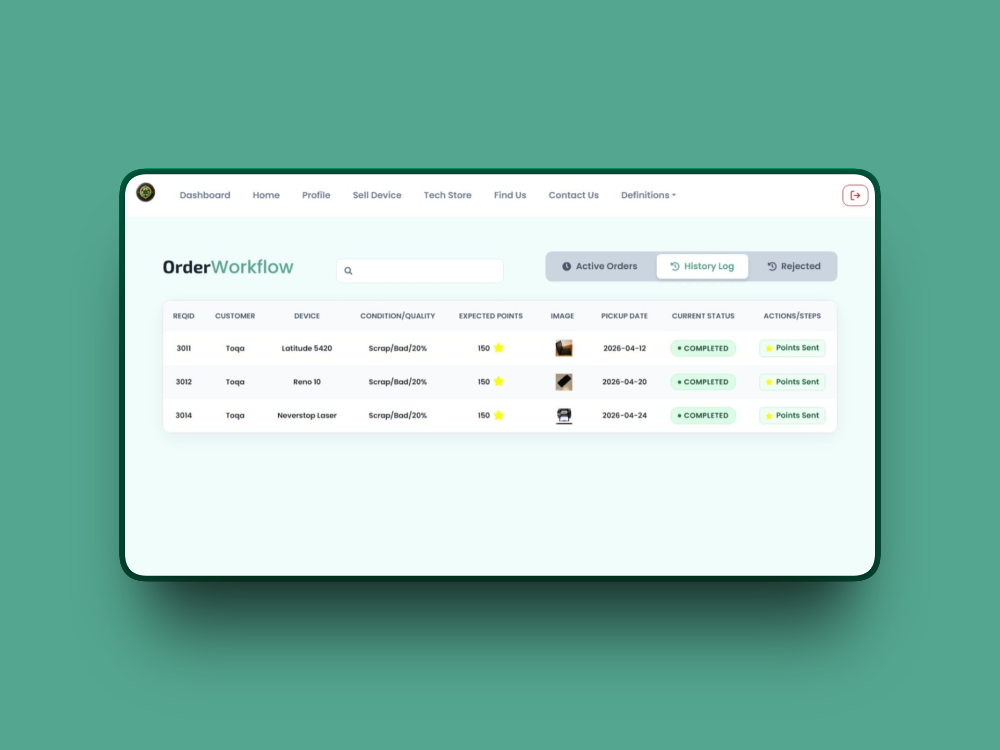
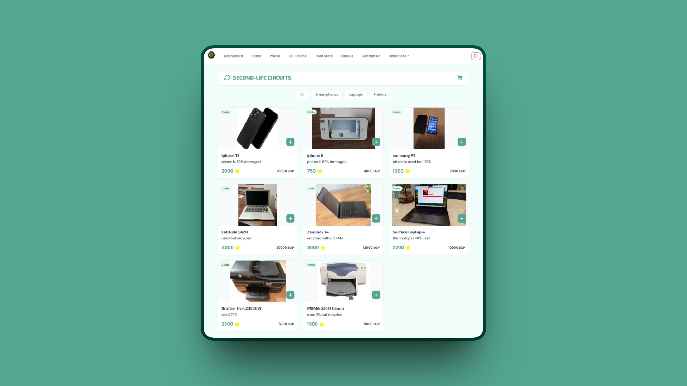
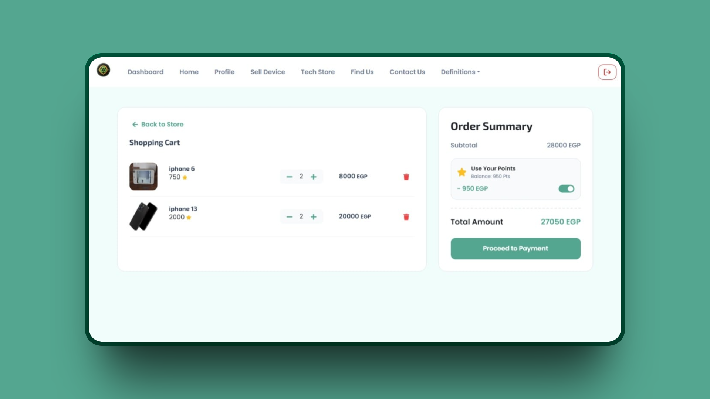
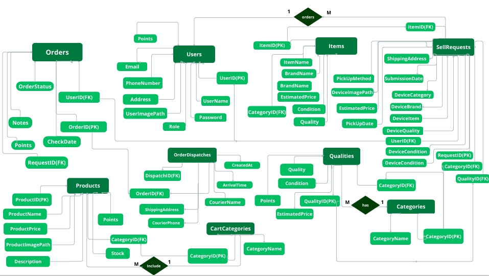
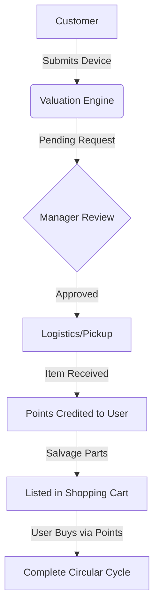

# Electronic Waste (E-Waste) Management & Recycling System

A Full-Stack Circular Economy solution that digitizes e-waste recycling from automated device valuation to component recovery and points-based reselling.
##  Why This Project? (The Problem)
Electronic waste often ends up in landfills, causing environmental hazards. This system solves this by incentivizing users to recycle through a Loyalty Rewards Program, turning old devices into valuable salvaged components for a sustainable e-commerce marketplace.

##  Tech Stack
*   **Backend:** .NET Core Web API, Entity Framework Core, **JWT (Secure Auth)**, BCrypt Hashing.
*   **Frontend:** React.js, Redux Toolkit, Chart.js, CSS, Bootstrap 5.
*   **Database:** MS SQL Server.

##  Core Features
### 1. Secure Authentication & RBAC
A secure entry system using **JWT Tokens** to manage permissions for both **Admins** and **Customers**.

  
  

### 2. Smart Valuation Engine (User Journey)
Users can submit their old devices. The system calculates an **Instant Price Estimate** based on the technical condition.

  
  

### 3. Admin Decision Engine & Analytics
Admins monitor business performance and manage the recycling workflow through a high-level **Data Dashboard**.

  
  

### 4. Component Marketplace & Cart
Functional spare parts are listed in a marketplace where users can redeem their **Loyalty Points**.

  
  

##  Database Architecture & Logic
The system relies on a robust relational schema:
* **One-to-Many:** Users ➡️ Recycling Requests.
* **One-to-Many:** Recycled Device ➡️ Salvaged Components.
* **Automation:** The system automatically calculates loyalty points based on device condition and updates the user's wallet balance upon manager approval. 

###  Database Schema (ERD)
The system relies on a highly normalized relational schema to ensure data integrity.

##  System Workflow (Business Logic)

## 🔧 Installation & Setup
1. Clone the repo: `git clone https://github.com/Toqa-Ashraf8/Electronic_Waste_Recycling_System.git`
2. **Backend:** - Update `appsettings.json` with your SQL connection string.ٍ
   - Run `dotnet ef database update`.
   - Run `dotnet run`.
3. **Frontend:** - Run `npm install`.
   - Run `npm start`.
